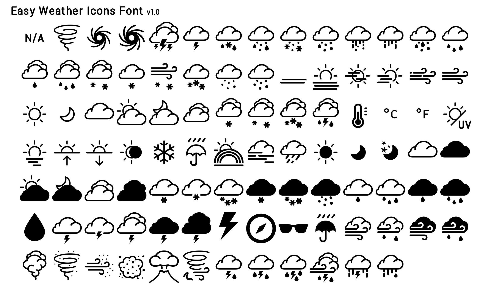
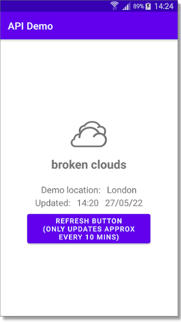
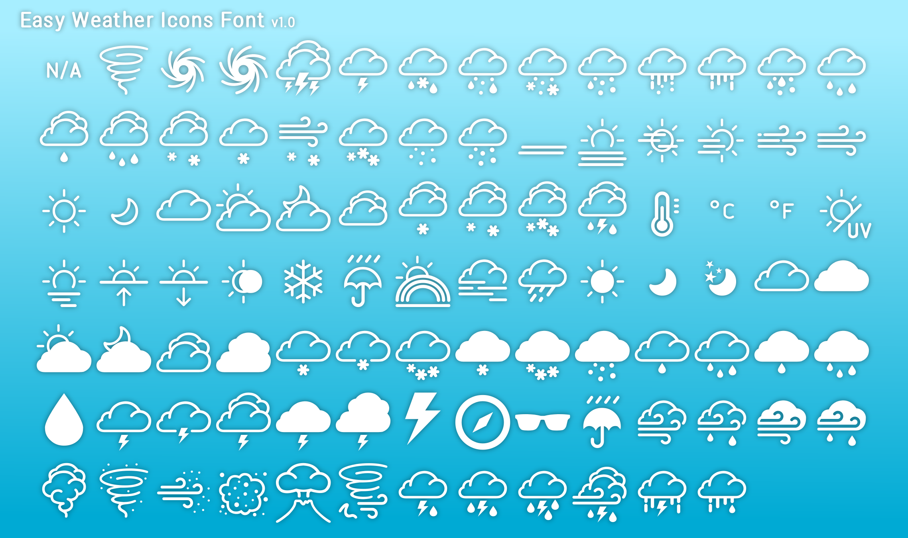

# Easy Weather Icons Font

<br>



This font is designed to be easily compatible across a large variety of uses (Apps, Windows, KWGT, OpenWeatherMap, meteo etc.) and so it has far more icons than are actually used for any single application as well as including additional day and night versions of all the icons to allow for a simple universal suffix to display a complete set of icons for each of those conditions - for use of day/night icons please see the How to guides below.  

(The above image shows just a sample of the icons that this font contains - download and open `easy_weather_icons_font_(fonts)/demo.html` in a browser or use Character Map in Windows to view the full .ttf icon set.)

It is similar in appearance to the early version of Samsung's Easy Mode Accuweather Icons and so is ideal for use when making functional or easy to understand apps or in those that replace classic or discontinued versions.  

Typically use as you would any other TrueType icon font (.ttf) (or please see details in the How to guides below) - for the seperate icons you can also use the individual .svg image files included.

Can be used as a direct replacement for 'meteo' icon font.

For use in Apps you will need to include the font conversion code given in the App example further below (also included in the download .txt file.)

## Weather Icons Font, Free Icon Font, KWGT, KWLP, Icon Font, FontIcon, Weather Font, OpenWeatherMap, Easy Mode, Meteo, Icons, Font, TTF, JSON, SVG, Free.
## Files included:
* easy_weather_icons_font.ttf
* easy_weather_icons_font.json
* How to use easy_weather_icons_font (includes font conversion code and icon lists).txt
* easy_weather_icons_font_(fonts)
* easy_weather_icons_font_(sample images)
* easy_weather_icons_font_(svg's)
* API Demo.apk

<br>

[Download .zip](https://github.com/boxbot6/easy-weather-icons-font-v1.0/raw/main/downloads/easy-weather-icons-font-v1.0.zip)

<br>

**Sizes:** vector icon dimensions 32x32px

<br>

To use:
- Download and unzip the files.
- Use the .ttf as you would any other icon font (in Windows it's best to install new fonts as administrator for 'all users' to allow them to list correctly in third party programs like Inkscape etc.).
- In Windows use Character Map to easily select and copy the icons you want and then paste them into your work.
- Don't forget to embed, link or include the font with your work when exporting it to use elsewhere.

<br>

To edit:
- Copy 'easy_weather_icons_font.json' (contains the complete set) or just the individual icons (svg's) that you want to use into a free font editor like IcoMoon or FontForge where you can edit them and/or create your own new font.

<br>

How to use in KWGT: (compatible where you previously used 'meteo' or other icon fonts.)
- Copy 'easy-weather-icons-font.ttf' and 'easy-weather-icons-font.json' to the folder Kustom/icons on your device.
- Choose this FontIcon/Set when adding a FontIcon or using one inside a Komponent like FontWeather (included in the free pre-installed Komponent Base Pack).
- (note: press the padlock symbol top right in the KWGT menu to unlock access to change the FontIcon/Set inside a Komponent.)

To use the day/night icons in KWGT:
- If using: `$wi(icon)$` in the formula editor to show icons, replace it with: `$if(ai(isday)=1,wi(icon)+day,wi(icon)+night)$`
- If using: `$wi(code)$` in the formula editor to show icons, replace it with: `$if(ai(isday)=1,wi(code)+day,wi(code)+night)$`

**note:** also contains extra icons not included in the original KWGT current weather lists - if you want to display these extra icons you will need
to code additionally for each one you want to show in the formula editor.  
e.g. to show an umbrella icon instead of the rain icon use: `$if(wi(icon)=RAIN,UMBRELLA)$`

<br>

How to use in Apps:

- Create new font folder: app/res/font and copy 'easy_weather_icons_font.ttf' to it.
- Reference the font where you want to use it in your layout using: `android:fontFamily="@font/easy_weather_icons_font"`

<br>

How to show the current weather icon in your app using OpenWeatherMap and Android Studio (includes using the day/night icons).  
//general overview of the method with an example below//

- Get the current weather data by making an API call (basically a request for information) to openweathermap by sending a free key.  
(How to make an API call instructions at <https://openweathermap.org/current> or see example below - open a free openweathermap account to get your own API key.)

- Use the response from openweathermap to populate some new variables: sunrise, sunset, updatedAt and description.
(The example-code below uses the 'description' part of the response from openweathermap rather than 'main' or 'icon' because it contains the
largest range of weather conditions.)

- Use sunrise, sunset and updatedAt to create a night-time indicator tag (nightTag) to use in conjunction with the description.

- Use description and nightTag in the font conversion code 'convert openweathermap descriptions to easy_weather_icons_font' (given in the MainActivity example-code below) to display the corresponding icon from the font.

<br>

API Demo.apk

(A simple demo app that uses easy_weather_icons_font with OpenWeatherMap API is included in the download for you to try and experiment with - for those interested in the coding it was constructed as described below. (Otherwise you can just install the app and try it out).  

<br>



<br>

//example//

- In Android Studio create a new project named 'API Demo' with an Empty Activity.

- Create new font folder app/res/font and copy 'easy_weather_icons_font.ttf' to it.

- Copy below code to AndroidManifest.xml.

```
<?xml version="1.0" encoding="utf-8"?>
<manifest xmlns:android="http://schemas.android.com/apk/res/android"
    package="com.parallelcodes.apidemo">
    <uses-permission android:name="android.permission.INTERNET" />

    <application
        android:allowBackup="true"
        android:icon="@mipmap/ic_launcher"
        android:label="@string/app_name"
        android:roundIcon="@mipmap/ic_launcher_round"
        android:supportsRtl="true"
        android:theme="@style/Theme.APIDemo"
        android:usesCleartextTraffic="true">
        <activity
            android:name=".MainActivity"
            android:exported="true">
            <intent-filter>
                <action android:name="android.intent.action.MAIN" />

                <category android:name="android.intent.category.LAUNCHER" />
            </intent-filter>
        </activity>
    </application>

</manifest>
 ```

- Copy below code to MainActivity (this part includes the raw code to 'convert openweathermap descriptions to easy_weather_icons_font' - if you are writing your own app you can incorporate just this font conversion list into your own code.)

```
package com.parallelcodes.apidemo;

import android.os.AsyncTask;
import android.os.Bundle;
import android.view.View;
import android.widget.TextView;
import android.widget.Toast;

import androidx.appcompat.app.AppCompatActivity;

import org.json.JSONException;
import org.json.JSONObject;

import java.text.SimpleDateFormat;
import java.util.Locale;

public class MainActivity extends AppCompatActivity {


    @Override
    protected void onCreate(Bundle savedInstanceState) {
        super.onCreate(savedInstanceState);
        setContentView(R.layout.activity_main);

        new APIWeatherCall().execute();
    }


    public void refreshButton(View view) {

        new APIWeatherCall().execute();
    }


    class APIWeatherCall extends AsyncTask<String, Void, String> {


        @Override
        protected void onPreExecute() {
            super.onPreExecute();
        }


        @Override
        protected String doInBackground(String args[]) {

            // this is just a fixed location example, add code to get your location and you can use your current GPS position here
            double latitude = 51.507351;
            double longitude = -0.127758;

            // put your own API_key here
            String API_keyText = "b190a0605344cc4f3af08d0dd473dd25"; // alternative demo key "307ec986e69c22c9a24a1bcf9edd21ea"
            
            // there are many options to customise an API call, this is just a simple example only using latitude, longitude and the API_key
            return HttpRequest.excuteGet("https://api.openweathermap.org/data/2.5/weather?lat=" + latitude + "&lon=" + longitude + "&units=metric&appid=" + API_keyText +"");
        }


        @Override
        protected void onPostExecute(String result) {

            try {
                // create JSON objects from the API response
                JSONObject jsonObj = new JSONObject(result);
                JSONObject main = jsonObj.getJSONObject("main");
                JSONObject sys = jsonObj.getJSONObject("sys");
                JSONObject weather = jsonObj.getJSONArray("weather").getJSONObject(0);


                // collect strings and data from json object
                String location = jsonObj.getString("name"); // + ", " + sys.getString("country");
                String temperature = (String.format("%.0f", main.getDouble("temp")) + "°C");
                String description = weather.getString("description"); // String icon = weather.getString("main");
                Long sunrise = sys.getLong("sunrise");
                Long sunset = sys.getLong("sunset");
                Long updatedAt = jsonObj.getLong("dt");
                String updatedAtFormatted = "Updated:   " + new SimpleDateFormat("HH:mm   dd/MM/yy", Locale.ENGLISH).format(updatedAt * 1000);


                // use sunrise, sunset and updatedAt variables above to create a tag for night time:
                Boolean nightTag;
                if (updatedAt >= sunrise && updatedAt < sunset) {
                    nightTag = false;
                } else {
                    nightTag = true;
                }


                if ("Globe".equalsIgnoreCase(location)){
                    location = "Not Available";
                    description = "Not Available";
                }


                if("Greater London".equalsIgnoreCase(location)){
                    location = "London";
                }


                // convert openweathermap descriptions to easy_weather_icons_font
		// (feel free to use this font conversion list code independently in your own app.)
	
                String icon = "\uE900"; // creates icon string and sets default icon to: (N/A)

                if (description.equals(null)) { icon = "\uE900"; } // sets null icon to: (N/A)
                if (description.equals("")) { icon = "\uE900"; } // sets empty icon to: (N/A)
                if (description.equals("clear sky")) { icon = "\uE96D"; } // CLEARday
                if ((description.equals("clear sky")) && nightTag) { icon = "\uE96E"; } // CLEARnight
                if (description.equals("few clouds")) { icon = "\uE967"; } //  PARTLY_CLOUDYday (few clouds: 11-25%)
                if ((description.equals("few clouds")) && nightTag) { icon = "\uE968"; } //  PARTLY_CLOUDYnight (few clouds: 11-25%)
                if (description.equals("scattered clouds")) { icon = "\uE9D3"; } //  CLOUD2day (scattered clouds: 25-50%)
                if ((description.equals("scattered clouds")) && nightTag) { icon = "\uE9D4"; } //  CLOUD2night (scattered clouds: 25-50%)
                if (description.equals("broken clouds")) { icon = "\uE9DF"; } //  CLOUDY2day (broken clouds: 51-84%)
                if ((description.equals("broken clouds")) && nightTag) { icon = "\uE9E0"; } // CLOUDY2night (broken clouds: 51-84%)
                if (description.equals("overcast clouds")) { icon = "\uE961"; } //  MOSTLY_CLOUDYday (overcast clouds: 85-100%)
                if ((description.equals("overcast clouds")) && nightTag) { icon = "\uE962"; } // MOSTLY_CLOUDYnight (overcast clouds: 85-100%)
                if (description.equals("shower rain")) { icon = "\uE928"; } // SHOWERSday
                if ((description.equals("shower rain")) && nightTag) { icon = "\uE929"; } // SHOWERSnight
                if (description.equals("rain")) { icon = "\uE92E"; } // RAINday
                if ((description.equals("rain")) && nightTag) { icon = "\uE932"; } // RAINnight
                if (description.equals("thunderstorm")) { icon = "\uE910"; } // THUNDERSTORMSday
                if ((description.equals("thunderstorm")) && nightTag) { icon = "\uE911"; } // THUNDERSTORMSnight
                if (description.equals("snow")) { icon = "\uE940"; } // SNOWday
                if ((description.equals("snow")) && nightTag) { icon = "\uE941"; } // SNOWnight
                if (description.equals("mist")) { icon = "\uEA42"; } // mistday
                if ((description.equals("mist")) && nightTag) { icon = "\uEA43"; } // mistnight
                if (description.equals("thunderstorm with light rain")) { icon = "\uEA60"; } //  thunderstorm_with_light_rainday
                if ((description.equals("thunderstorm with light rain")) && nightTag) { icon = "\uEA61"; } //  thunderstorm_with_light_rainnight
                if (description.equals("thunderstorm with rain")) { icon = "\uEA63"; } //  thunderstorm_with_rainday
                if ((description.equals("thunderstorm with rain")) && nightTag) { icon = "\uEA64"; } //  thunderstorm_with_rainnight
                if (description.equals("thunderstorm with heavy rain")) { icon = "\uEA66"; } //  thunderstorm_with_heavy_rainday
                if ((description.equals("thunderstorm with heavy rain")) && nightTag) { icon = "\uEA67"; } //  thunderstorm_with_heavy_rainnight
                if (description.equals("light thunderstorm")) { icon = "\uE910"; } //  THUNDERSTORMSday
                if ((description.equals("light thunderstorm")) && nightTag) { icon = "\uE911"; } //  THUNDERSTORMSnight
                if (description.equals("heavy thunderstorm")) { icon = "\uE90D"; } //  SEVERE_THUNDERSTORMSday
                if ((description.equals("heavy thunderstorm")) && nightTag) { icon = "\uE90E"; } //  SEVERE_THUNDERSTORMSnight
                if (description.equals("ragged thunderstorm")) { icon = "\uEA69"; } //  ragged_thunderstormday
                if ((description.equals("ragged thunderstorm")) && nightTag) { icon = "\uEA6A"; } //  ragged_thunderstormnight
                if (description.equals("thunderstorm with light drizzle")) { icon = "\uE982"; } //  THUNDERSHOWERSday
                if ((description.equals("thunderstorm with light drizzle")) && nightTag) { icon = "\uE983"; } //  THUNDERSHOWERSnight
                if (description.equals("thunderstorm with drizzle")) { icon = "\uEA6C"; } //  thunderstorm_with_drizzleday
                if ((description.equals("thunderstorm with drizzle")) && nightTag) { icon = "\uEA6D"; } //  thunderstorm_with_drizzlenight
                if (description.equals("thunderstorm with heavy drizzle")) { icon = "\uE982"; } //  THUNDERSHOWERSday
                if ((description.equals("thunderstorm with heavy drizzle")) && nightTag) { icon = "\uE983"; } //  THUNDERSHOWERSnight
                if (description.equals("light intensity drizzle")) { icon = "\uE922"; } //  DRIZZLEday
                if ((description.equals("light intensity drizzle")) && nightTag) { icon = "\uE923"; } //  DRIZZLEnight
                if (description.equals("drizzle")) { icon = "\uE922"; } //  DRIZZLEday
                if ((description.equals("drizzle")) && nightTag) { icon = "\uE923"; } //  DRIZZLEnight
                if (description.equals("heavy intensity drizzle")) { icon = "\uE922"; } //  DRIZZLEday
                if ((description.equals("heavy intensity drizzle")) && nightTag) { icon = "\uE923"; } //  DRIZZLEnight
                if (description.equals("light intensity drizzle rain")) { icon = "\uE922"; } //  DRIZZLEday
                if ((description.equals("light intensity drizzle rain")) && nightTag) { icon = "\uEA70"; } //  DRIZZLEnight
                if (description.equals("drizzle rain")) { icon = "\uEA6F"; } //  drizzle_rainday
                if ((description.equals("drizzle rain")) && nightTag) { icon = "\uEA01"; } //  drizzle_rainnight
                if (description.equals("heavy intensity drizzle rain")) { icon = "\uEA00"; } //  RAINYday
                if ((description.equals("heavy intensity drizzle rain")) && nightTag) { icon = "\uEA01"; } //  RAINYnight
                if (description.equals("shower rain and drizzle")) { icon = "\uE928"; } //  SHOWERSday
                if ((description.equals("shower rain and drizzle")) && nightTag) { icon = "\uE929"; } //  SHOWERSnight
                if (description.equals("heavy shower rain and drizzle")) { icon = "\uE931"; } //  HEAVY_SHOWERSday
                if ((description.equals("heavy shower rain and drizzle")) && nightTag) { icon = "\uE932"; } //  HEAVY_SHOWERSnight
                if (description.equals("shower drizzle")) { icon = "\uE928"; } //  SHOWERSday
                if ((description.equals("shower drizzle")) && nightTag) { icon = "\uE929"; } //  SHOWERSnight
                if (description.equals("light rain")) { icon = "\uEA00"; } //  RAINYday
                if ((description.equals("light rain")) && nightTag) { icon = "\uEA01"; } //  RAINYnight
                if (description.equals("moderate rain")) { icon = "\uE92E"; } // RAINday
                if ((description.equals("moderate rain")) && nightTag) { icon = "\uE932"; } // RAINnight
                if (description.equals("heavy intensity rain")) { icon = "\uE92E"; } // RAINday
                if ((description.equals("heavy intensity rain")) && nightTag) { icon = "\uE932"; } // RAINnight
                if (description.equals("very heavy rain")) { icon = "\uEA03"; } // RAINY2day
                if ((description.equals("very heavy rain")) && nightTag) { icon = "\uEA04"; } // RAINY2night
                if (description.equals("extreme rain")) { icon = "\uEA03"; } // RAINY2day
                if ((description.equals("extreme rain")) && nightTag) { icon = "\uEA04"; } // RAINY2night
                if (description.equals("freezing rain")) { icon = "\uE925"; } // FREEZING_RAINday
                if ((description.equals("freezing rain")) && nightTag) { icon = "\uE926"; } // FREEZING_RAINnight
                if (description.equals("light intensity shower rain")) { icon = "\uE928"; } //  SHOWERSday
                if ((description.equals("light intensity shower rain")) && nightTag) { icon = "\uE929"; } //  SHOWERSnight
                if (description.equals("heavy intensity shower rain")) { icon = "\uE931"; } //  HEAVY_SHOWERSday
                if ((description.equals("heavy intensity shower rain")) && nightTag) { icon = "\uE932"; } //  HEAVY_SHOWERSnight
                if (description.equals("ragged shower rain")) { icon = "\uE928"; } //  SHOWERSday
                if ((description.equals("ragged shower rain")) && nightTag) { icon = "\uE929"; } //  SHOWERSnight
                if (description.equals("light snow")) { icon = "\uE937"; } //  LIGHT_SNOW_SHOWERSday
                if ((description.equals("light snow")) && nightTag) { icon = "\uE938"; } //  LIGHT_SNOW_SHOWERSnight
                if (description.equals("heavy snow")) { icon = "\uE97C"; } //  HEAVY_SNOWday
                if ((description.equals("heavy snow")) && nightTag) { icon = "\uE97D"; } //  HEAVY_SNOWnight
                if (description.equals("sleet")) { icon = "\uE946"; } //  SLEETday
                if ((description.equals("sleet")) && nightTag) { icon = "\uE947"; } //  SLEETnight
                if (description.equals("light shower sleet")) { icon = "\uE919"; } //  MIXED_RAIN_SLEETday
                if ((description.equals("light shower sleet")) && nightTag) { icon = "\uE91A"; } //  MIXED_RAIN_SLEETnight
                if (description.equals("shower sleet")) { icon = "\uE919"; } //  MIXED_RAIN_SLEETday
                if ((description.equals("shower sleet")) && nightTag) { icon = "\uE91A"; } //  MIXED_RAIN_SLEETnight
                if (description.equals("light rain and snow")) { icon = "\uE916"; } //  MIXED_RAIN_SNOWday
                if ((description.equals("light rain and snow")) && nightTag) { icon = "\uE917"; } //  MIXED_RAIN_SNOWnight
                if (description.equals("rain and snow")) { icon = "\uE916"; } //  MIXED_RAIN_SNOWday
                if ((description.equals("rain and snow")) && nightTag) { icon = "\uE917"; } //  MIXED_RAIN_SNOWnight
                if (description.equals("light shower snow")) { icon = "\uE97F"; } //  SCATTERED_SNOW_SHOWERSday
                if ((description.equals("light shower snow")) && nightTag) { icon = "\uE980"; } //  SCATTERED_SNOW_SHOWERSnight
                if (description.equals("shower snow")) { icon = "\uE988"; } //  SNOW_SHOWERSday
                if ((description.equals("shower snow")) && nightTag) { icon = "\uE989"; } //  SNOW_SHOWERSnight
                if (description.equals("heavy shower snow")) { icon = "\uE97C"; } //  HEAVY_SNOWday
                if ((description.equals("heavy shower snow")) && nightTag) { icon = "\uE97D"; } //  HEAVY_SNOWnight
                if (description.equals("smoke")) { icon = "\uEA45"; } //  smokeday
                if ((description.equals("smoke")) && nightTag) { icon = "\uEA46"; } //  smokenight
                if (description.equals("haze")) { icon = "\uE952"; } //  HAZEday
                if ((description.equals("haze")) && nightTag) { icon = "\uE953"; } //  HAZEnight
                if (description.equals("sand/ dust whirls")) { icon = "\uEA4B"; } //  sand/_dust_whirlsday
                if ((description.equals("sand/ dust whirls")) && nightTag) { icon = "\uEA4C"; } //  sand/_dust_whirlsnight
                if (description.equals("fog")) { icon = "\uE94F"; } // FOGday
                if ((description.equals("fog")) && nightTag) { icon = "\uE950"; } // FOGnight
                if (description.equals("sand")) { icon = "\uEA51"; } //  sandday
                if ((description.equals("sand")) && nightTag) { icon = "\uEA52"; } //  sandnight
                if (description.equals("dust")) { icon = "\uEA51"; } //  DUSTday
                if ((description.equals("dust")) && nightTag) { icon = "\uE94A"; } //  DUSTnight
                if (description.equals("volcanic ash")) { icon = "\uEA57"; } //  volcanic_ashday
                if ((description.equals("volcanic ash")) && nightTag) { icon = "\uEA58"; } //  volcanic_ashnight
                if (description.equals("squalls")) { icon = "\uEA5A"; } //  squallsday
                if ((description.equals("squalls")) && nightTag) { icon = "\uEA5B"; } //  squallsnight
                if (description.equals("tornado")) { icon = "\uE904"; } //  TORNADOday
                if ((description.equals("tornado")) && nightTag) { icon = "\uE905"; } //  TORNADOnight


                // set layout id's
                TextView locationText = findViewById(R.id.displayLocationText);
                TextView descriptionText = findViewById(R.id.displayDescriptionText);
                TextView updatedAtText = findViewById(R.id.displayUpdatedAtText);
                TextView iconText = findViewById(R.id.displayWeatherIconText);


                // show values
                locationText.setText("Demo location:   " + location);
                descriptionText.setText(description);
                updatedAtText.setText(updatedAtFormatted);
                iconText.setText(icon);


            } catch (JSONException e) {
                Toast.makeText(MainActivity.this, "Oops, Unable to get data from openweathermap!", Toast.LENGTH_SHORT).show();
                e.printStackTrace();
            }
        }
    }
}
```

- Copy below layout code to activity_main.xml.

```
<?xml version="1.0" encoding="utf-8"?>
<RelativeLayout xmlns:android="http://schemas.android.com/apk/res/android"
    android:layout_width="match_parent"
    android:layout_height="match_parent"
    android:gravity="center">

    <TextView
        android:id="@+id/displayWeatherIconText"
        android:layout_width="match_parent"
        android:layout_marginTop="5dp"
        android:hint="Icon"
        android:layout_height="90dp"
        android:layout_alignParentStart="true"
        android:layout_centerVertical="true"
        android:fontFamily="@font/easy_weather_icons_font"
        android:gravity="center"
        android:textSize="80dp" />

    <TextView
        android:id="@+id/displayDescriptionText"
        android:layout_width="match_parent"
        android:layout_below="@+id/displayWeatherIconText"
        android:gravity="center"
        android:layout_marginTop="0dp"
        android:hint="Description"
        android:layout_height="32dp"
        android:textSize="24dp"
        android:textStyle="bold"/>

    <TextView
        android:id="@+id/displayLocationText"
        android:layout_width="match_parent"
        android:layout_height="wrap_content"
        android:layout_below="@+id/displayDescriptionText"
        android:gravity="center"
        android:layout_marginTop="22dp"
        android:hint="Location"
        android:minHeight="28dp"
        android:textSize="18dp" />

    <TextView
        android:id="@+id/displayUpdatedAtText"
        android:layout_width="match_parent"
        android:layout_height="wrap_content"
        android:layout_below="@+id/displayLocationText"
        android:gravity="center"
        android:layout_marginTop="0dp"
        android:hint="Updated at"
        android:textSize="18dp" />

    <Button
        android:id="@+id/button"
        android:layout_width="250dp"
        android:layout_height="wrap_content"
        android:minHeight="60dp"
        android:layout_below="@+id/displayUpdatedAtText"
        android:layout_centerHorizontal="true"
        android:layout_centerVertical="true"
        android:layout_marginTop="5dp"
        android:onClick="refreshButton"
        android:text="REFRESH BUTTON\n(only updates approx every 10 mins)" />

</RelativeLayout>
```

- Create a new java class alongside MainActivity called HttpRequest and copy the below code to it.

```
package com.parallelcodes.apidemo;

import java.io.BufferedReader;
import java.io.InputStream;
import java.io.InputStreamReader;
import java.net.HttpURLConnection;
import java.net.URL;

public class HttpRequest {
    public static String excuteGet(String targetURL) {
        URL url;
        HttpURLConnection connection = null;
        try {
            url = new URL(targetURL);
            connection = (HttpURLConnection) url.openConnection();
            connection.setRequestMethod("GET");
            InputStream is;

            //retrieve data from url
            int status = connection.getResponseCode();
            if (status != HttpURLConnection.HTTP_OK)
                is = connection.getErrorStream();
            else
                is = connection.getInputStream();
            BufferedReader rd = new BufferedReader(new InputStreamReader(is));
            String line;
            StringBuffer response = new StringBuffer();
            while ((line = rd.readLine()) != null) {
                response.append(line);
                response.append('\r');
            }
            rd.close();
            return response.toString();
        } catch (Exception e) {
            e.printStackTrace();
            return null;
        } finally {
            if (connection != null) {
                connection.disconnect();
            }
        }
    }
}
```

- Build the APK and test.

- If it doesn't work? - make sure you have put your own valid API_key in `MainActivity/class APIWeatherCall` and have internet permission and access.

<br>

___

## Reference list of the easy_weather_icons_font names:

UNKNOWN  
TORNADO  
TROPICAL_STORM  
HURRICANE  
SEVERE_THUNDERSTORMS  
THUNDERSTORMS  
TSTORM  
MIXED_RAIN_SNOW  
MIXED_RAIN_SLEET  
MIXED_SNOW_SLEET  
FREEZING_DRIZZLE  
DRIZZLE  
FREEZING_RAIN  
SHOWERS  
SHOWER  
RAIN  
HEAVY_SHOWERS  
SNOW_FLURRIES  
LIGHT_SNOW_SHOWERS  
LSNOW  
BLOWING_SNOW  
SNOW  
HAIL  
SLEET  
DUST  
FOGGY  
FOG  
HAZE  
SMOKY  
BLUSTERY  
WINDY  
CLOUDY  
MOSTLY_CLOUDY  
MCLOUDY  
PARTLY_CLOUDY  
PCLOUDY  
CLEAR  
FAIR  
MIXED_RAIN_AND_HAIL  
ISOLATED_THUNDERSTORMS  
SCATTERED_SHOWERS  
HEAVY_SNOW  
SCATTERED_SNOW_SHOWERS  
THUNDERSHOWERS  
TSHOWER  
SNOW_SHOWERS  
ISOLATED_THUNDERSHOWERS  
NOT_AVAILABLE  
THERMOMETER  
CENTIGRADE  
FAHRENHEIT  
UV_LEVEL  
SUNRISE  
SUNRISE2  
SUNSET2  
ECLIPSE  
SNOWFLAKE  
UMBRELLA  
RAINBOW  
FOGCLOUD  
WINDY_DRIZZLE  
WINDY_CLOUDY  
sun  
sun2  
sun3  
sunrise2  
moon  
moon2  
moonstars  
cloud  
cloud2  
cloud3  
cloud4  
cloud5  
cloudy2  
cloudy3  
cloudy4  
lightning  
lightning2  
lightning3  
lightning4  
lightning5  
lightning39  
rainy  
rainy2  
rainy3  
rainy4  
raindrop  
wind  
windy  
windy2  
windy3  
windy4  
windy5  
snowy  
snowy2  
snowy3  
snowy4  
snowy5  
snow263  
snowshower  
snowshower2  
snowflake  
thermometer2  
celsius  
sunglasses  
umbrella2  
compass  
none  
mist  
smoke  
haze2  
sand_dust_whirls  
fog2  
sand  
dust2  
ash  
squall  
tornado2  
thunderstorm_with_light_rain  
thunderstorm_with_rain  
thunderstorm_with_heavy_rain  
ragged_thunderstorm  
thunderstorm_with_drizzle  
drizzle_rain  

Also contains day and night versions of each of the icons in the above list, e.g.  

FOGGY  
FOGGYday  
FOGGYnight

(To show differing day and night icons without having to code for each one individually all the other icons also needed to have day and night versions added so that a simple universal suffix can be used to display a complete set of icons for each condition - for use of day/night icons please see the How to guides above).    

This font is designed to be easily compatible across a number of uses (Apps, Windows, KWGT, OpenWeatherMap, meteo etc.) and so it has far more icons than are actually used for any single application - for a specific use you could heavily edit it.

<br>



___

See below for references of the components used:

<br>

### KWGT Current weather icon list (15) - to display use `$wi(icon)$` in Formula Editor

UNKNOWN  
TORNADO*  
TSTORM  
TSHOWER  
SHOWER  
RAIN  
SLEET*  
LSNOW  
SNOW*  
HAIL*  
FOG  
WINDY*  
PCLOUDY  
MCLOUDY  
CLEAR*  

(duplicated in current weather code list)*

<br>

### KWGT Current weather code list (39) - to display use `$wi(code)$` in Formula Editor

TORNADO*  
TROPICAL_STORM  
HURRICANE  
SEVERE_THUNDERSTORMS  
THUNDERSTORMS  
MIXED_RAIN_SNOW  
MIXED_RAIN_SLEET  
MIXED_SNOW_SLEET  
FREEZING_DRIZZLE  
DRIZZLE  
FREEZING_RAIN  
SHOWERS  
HEAVY_SHOWERS  
SNOW_FLURRIES  
LIGHT_SNOW_SHOWERS  
BLOWING_SNOW  
SNOW*  
HAIL*  
SLEET*  
DUST  
FOGGY  
HAZE  
SMOKY  
BLUSTERY  
WINDY*  
CLOUDY  
MOSTLY_CLOUDY  
PARTLY_CLOUDY  
CLEAR*  
FAIR  
MIXED_RAIN_AND_HAIL  
ISOLATED_THUNDERSTORMS  
SCATTERED_SHOWERS  
HEAVY_SNOW  
SCATTERED_SNOW_SHOWERS  
THUNDERSHOWERS  
SNOW_SHOWERS  
ISOLATED_THUNDERSHOWERS  
NOT_AVAILABLE 

(duplicated in current weather icon list)*

<br>

### KWGT Current weather code & icon lists combined (without duplicates)  - plus a few extra icons** (62)

UNKNOWN  
TORNADO  
TROPICAL_STORM  
HURRICANE  
SEVERE_THUNDERSTORMS  
THUNDERSTORMS  
TSTORM  
MIXED_RAIN_SNOW  
MIXED_RAIN_SLEET  
MIXED_SNOW_SLEET  
FREEZING_DRIZZLE  
DRIZZLE  
FREEZING_RAIN  
SHOWERS  
SHOWER  
RAIN  
HEAVY_SHOWERS  
SNOW_FLURRIES  
LIGHT_SNOW_SHOWERS  
LSNOW  
BLOWING_SNOW  
SNOW  
HAIL  
SLEET  
DUST  
FOGGY  
FOG  
HAZE  
SMOKY  
BLUSTERY  
WINDY  
CLOUDY  
MOSTLY_CLOUDY  
MCLOUDY  
PARTLY_CLOUDY  
PCLOUDY  
CLEAR  
FAIR  
MIXED_RAIN_AND_HAIL  
ISOLATED_THUNDERSTORMS  
SCATTERED_SHOWERS  
HEAVY_SNOW  
SCATTERED_SNOW_SHOWERS  
THUNDERSHOWERS  
TSHOWER  
SNOW_SHOWERS  
ISOLATED_THUNDERSHOWERS  
NOT_AVAILABLE  
THERMOMETER**  
CENTIGRADE**  
FAHRENHEIT**  
UV_LEVEL**  
SUNRISE**  
SUNRISE2**  
SUNSET2**  
ECLIPSE**  
SNOWFLAKE**  
UMBRELLA**  
RAINBOW**  
FOGCLOUD**  
WINDY_DRIZZLE**  
WINDY_CLOUDY**  

(extra icons)** - these are not included in the original KWGT Current weather lists so you will need to define when to use each "NAME" in your formula editor code if you wish to show them.  
e.g. to show an umbrella icon instead of the rain icon use: `$if(wi(icon)=RAIN,UMBRELLA)$`

<br>

### \*\*\*Now updated with 'meteo' icon names for compatibility where you previously used the meteo icon font\*\*\*

sun  
sun2  
sun3  
sunrise2  
moon  
moon2  
moonstars  
cloud  
cloud2  
cloud3  
cloud4  
cloud5  
cloudy2  
cloudy3  
cloudy4  
lightning  
lightning2  
lightning3  
lightning4  
lightning5  
lightning39  
rainy  
rainy2  
rainy3  
rainy4  
raindrop  
wind  
windy  
windy2  
windy3  
windy4  
windy5  
snowy  
snowy2  
snowy3  
snowy4  
snowy5  
snow263  
snowshower  
snowshower2  
snowflake  
thermometer2  
celsius  
sunglasses  
umbrella2  
compass  
none  

<br>

### \*\*\*\*Now also updated with some OpenWeatherMap 'Descriptions' below for compatibility with OpenWeatherMap API\*\*\*\* 
(The remaining OpenWeatherMap icons that are not included here are substituted by the app conversion code for similar icons already included in the font.)

mist  
smoke  
haze2  
sand_dust_whirls  
fog2  
sand  
dust2  
ash  
squall  
tornado2  
thunderstorm_with_light_rain  
thunderstorm_with_rain  
thunderstorm_with_heavy_rain  
ragged_thunderstorm  
thunderstorm_with_drizzle  
drizzle_rain  

<br>

### \*\*\*\*\*OpenWeatherMap references\*\*\*\*\*

See https://openweathermap.org/weather-conditions for details of the OpenWeatherMap icons.

<br>

OpenWeatherMap Icon list:

```
Day icon	Night icon	Description  
01d.png 	01n.png 	clear sky  
02d.png 	02n.png 	few clouds  
03d.png 	03n.png 	scattered clouds  
04d.png 	04n.png 	broken clouds  
09d.png 	09n.png 	shower rain  
10d.png 	10n.png 	rain  
11d.png 	11n.png 	thunderstorm  
13d.png 	13n.png 	snow  
50d.png 	50n.png 	mist  
```

Weather condition codes:

```
Group 2xx: Thunderstorm
ID	Main	        Description	                 Icon
200	Thunderstorm	thunderstorm with light rain	 11d
201	Thunderstorm	thunderstorm with rain  	 11d
202	Thunderstorm	thunderstorm with heavy rain	 11d
210	Thunderstorm	light thunderstorm       	 11d
211	Thunderstorm	thunderstorm	                 11d
212	Thunderstorm	heavy thunderstorm		 11d
221	Thunderstorm	ragged thunderstorm		 11d
230	Thunderstorm	thunderstorm with light drizzle	 11d
231	Thunderstorm	thunderstorm with drizzle	 11d
232	Thunderstorm	thunderstorm with heavy drizzle	 11d
```

```
Group 3xx: Drizzle
ID	Main	Description			 Icon
300	Drizzle	light intensity drizzle		 09d
301	Drizzle	drizzle				 09d
302	Drizzle	heavy intensity drizzle		 09d
310	Drizzle	light intensity drizzle rain	 09d
311	Drizzle	drizzle rain			 09d
312	Drizzle	heavy intensity drizzle rain	 09d
313	Drizzle	shower rain and drizzle		 09d
314	Drizzle	heavy shower rain and drizzle	 09d
321	Drizzle	shower drizzle			 09d
```

```
Group 5xx: Rain
ID	Main	Description	     		 Icon
500	Rain	light rain			 10d
501	Rain	moderate rain			 10d
502	Rain	heavy intensity rain		 10d
503	Rain	very heavy rain			 10d
504	Rain	extreme rain			 10d
511	Rain	freezing rain			 13d
520	Rain	light intensity shower rain	 09d
521	Rain	shower rain			 09d
522	Rain	heavy intensity shower rain	 09d
531	Rain	ragged shower rain		 09d
```

```
Group 6xx: Snow
ID	Main	Description	 	 Icon
600	Snow	light snow		 13d
601	Snow	Snow			 13d
602	Snow	Heavy snow		 13d
611	Snow	Sleet			 13d
612	Snow	Light shower sleet	 13d
613	Snow	Shower sleet		 13d
615	Snow	Light rain and snow	 13d
616	Snow	Rain and snow		 13d
620	Snow	Light shower snow	 13d
621	Snow	Shower snow		 13d
622	Snow	Heavy shower snow	 13d
```

```
Group 7xx: Atmosphere
ID	Main	Description		 Icon
701	Mist	mist			 50d
711	Smoke	Smoke			 50d
721	Haze	Haze			 50d
731	Dust	sand/ dust whirls 	 50d
741	Fog	fog			 50d
751	Sand	sand			 50d
761	Dust	dust			 50d
762	Ash	volcanic ash		 50d
771	Squall	squalls			 50d
781	Tornado	tornado			 50d
```

```
Group 800: Clear
ID	Main	Description	 Icon day	Icon night
800	Clear	clear sky	 01d		01n
```

```
Group 80x: Clouds
ID	Main	Description	   		 Icon day	Icon night
801	Clouds	few clouds: 11-25%		 02d		02n
802	Clouds	scattered clouds: 25-50%	 03d		03n
803	Clouds	broken clouds: 51-84%		 04d		04n
804	Clouds	overcast clouds: 85-100%	 04d		04n
```

<br>

### Simplified list of OpenWeatherMap Descriptions without duplicates (56)

clear sky  
few clouds  
scattered clouds  
broken clouds  
overcast clouds  
shower rain  
rain  
thunderstorm  
snow  
mist  
thunderstorm with light rain  
thunderstorm with rain  
thunderstorm with heavy rain  
light thunderstorm  
heavy thunderstorm  
ragged thunderstorm  
thunderstorm with light drizzle  
thunderstorm with drizzle  
thunderstorm with heavy drizzle  
light intensity drizzle  
drizzle  
heavy intensity drizzle  
light intensity drizzle rain  
drizzle rain  
heavy intensity drizzle rain  
shower rain and drizzle  
heavy shower rain and drizzle  
shower drizzle  
light rain  
moderate rain  
heavy intensity rain  
very heavy rain  
extreme rain  
freezing rain  
light intensity shower rain  
heavy intensity shower rain  
ragged shower rain  
light snow  
heavy snow  
sleet  
light shower sleet  
shower sleet  
light rain and snow  
rain and snow  
light shower snow  
shower snow  
heavy shower snow  
smoke  
haze  
sand/ dust whirls  
fog  
sand  
dust  
volcanic ash  
squalls  
tornado
